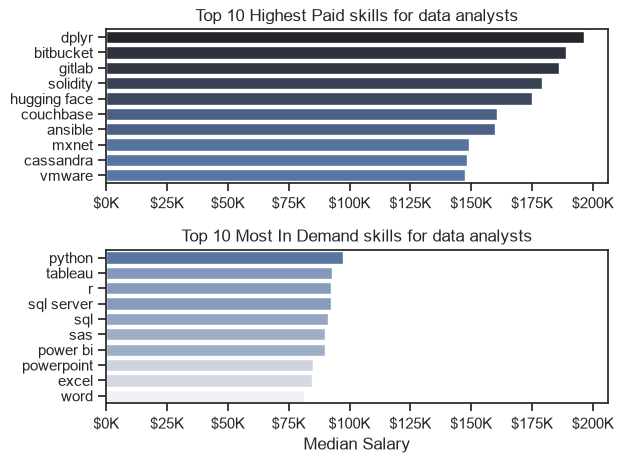

# Overview
Welcome to my analysis of the data job market, focusing on data analysis roles. I built this project to better understand the job landscape and what companies are looking for when hiring for a data analysis position. This project delves into the top-paying and in-demand skills companies are looking for in applicants to help find optimal job opportunities for data analysts.

The data sources from [Luke Barousse's Python Course](https://github.com/lukebarousse/Python_Data_Analytics_Course), which provides a foundation for my analysis, contains detailed information about job titles, salaries, locations, and essential job skills. Using Python, I explore questions including the most demanded skills, salary trends, and intersection of demand and salary in data analytics.

# The Questions
Here are the questions I'm addressing in this project:

1. What are the skills most in demand for the top 3 most popular data roles?
2. How are in-deamnd skills trending for Data Analysts?
3. How well do jobs and skills pay for Data Analysts?
4. What are skills that data analysts should learn to best succeed?

# Tools I Used

- Python: I used this to extract, clean, aggregate, and investigate the data to find the answers I was looking for. I also used these python libraries:
    - Pandas Library: Used to analyze the data
    - Matplotlib: Used to visualize the data
    - Seaborn: Used in conjunction with Matplotlib to create more advanced visuals
- Jupyter Notebooks: What I used to run my Python Scripts along with notes and analysis
- Visual Studio Code: Used to execute Python scripts
- Git & GitHub: Important for version control and sharing my code and analysis

# Data Prep and Cleanup

```
python
# Cleanup the dataset
df['job_posted_date'] = pd.to_datetime(df['job_posted_date'])
df['job_skills'] = df['job_skills'].apply(lambda x: ast.literal_eval(x) if pd.notna(x) else x)

```
Here I transformed the datatype of job_posted_date to datetime for more accurate analysis. I also cleaned the job skills by filtering out Null values

# The Analysis

Each Jupyter Notebook for this project is aimed at inestigating specific aspects of the data job market.

## 1. What are the most demanded skills for the top 3 post popular data roles?

To answer this question, I filtered out those data roles by which ones were the most popular and got back the top 5 skills for these top 3 roles. 

This query highelights the most popular job titles and their top skills, showing which skills I should pay attention to when I'm targeting a role I'd like to apply for.

View my notebook with detailed steps here:  [2_Skill_Demand.ipynb](Project\2_Skill_Demand.ipynb)

### Visualize Data


### Insights

- Python is a versatile skill that is highly demanded across all three roles. However, the need for Python skills is emphasized more in Data Engineer roles (64%) and Data Scientist roles (72%) while only 27% of Data Analyst roles list Python as a required skill.

- SQL is the most requested skill for Data Analysts (50%) and Data Engineers (68%) with SQL being listed in over half the job postings for both roles.

- Data Engineers require more specialized skills (AWS, Azure, Spark) that focus on the Cloud compared to Data Analysts and Data Scientists who are expected to be procficient in general data management tools (SQL, Tableau)


## 2. How are in-demand skills trending for Dta Analysts?

### Visualize Data

```
python

sns.lineplot(data=df_plot, dashes=False, palette='tab10')
sns.set_theme(style='ticks')
sns.despine()
plt.legend().remove()
plt.title("Trending Top Skills for Data Analysts in the US")
plt.ylabel("Likelihood in Job Posting")
plt.xlabel('2023')

from matplotlib.ticker import PercentFormatter

ax = plt.gca()
ax.yaxis.set_major_formatter(PercentFormatter(decimals=0))

for i in range(5):
    plt.text(11.2,df_plot.iloc[-1, i], df_plot.columns[i])        

plt.show() 
```

### Results


### Insights

- SQL remains the most consistent requested job skill throughout the year, althrough the demand seems to decrease slightly in Fall 2023.

- Excel mostly stayed in the lower percentile of requested skills but after October the demand increased, surpassing both Python and Tableau

- Both Python and Tableau show similar trends throughout the year, but in November Python saw a surge of demand that made it surpass Tableau.

- Power BI ranks 5th overall in requested skills for 2023. It shows a slight surge in demand in Febraury, but trends downward for the rest of the year. However, it is still a skill that some companies want.

## How well do jobs and salaries pay for a Data Analyst?

### Salary Analysis

```
sns.boxplot(data=df_US_top6, x="salary_year_avg", y="job_title_short", order=job_order) # we can call the groupby we just made here
sns.set_theme(style="ticks")

plt.title("Salary Distribution in the US")
plt.ylabel('')
plt.xlabel('Yearly Salary $USD')
ax = plt.gca()
ax.xaxis.set_major_formatter(plt.FuncFormatter(lambda x, _: f'${int(x/1000)}K'))
plt.xlim(0, 600000)
plt.show()
```


### Insights

- The salary rises with the progression of senior leadership roles. 

- Data Analysts have the lowest typical salaries ranging from $95K to $100K with the average salary between $75K and $115K along with outliers that are far greater than the standard Data Analyst salary range

- Senior Data Analysts have a similar salary range to Data Analysts below Data Engineers and Data Scientists. The median salary amount is around $110K with the average range between $95K - $125K. Addiionally, there are outliers that are higher, but are very unusual for a Senior Data Analyst.

- Data Engineers' salary ranges sit in the middle of this visualization with the median being $125K and the range being between $105K and $150K.

- Data Scientists have a similar median to Data Engineers but have a wider salary distribution. The average salary for a Data Scientist is around $132K. Data Scientists have the highest outlier range of all roles, with the highest being near $600K.

- The median salary for Senior Data Engineers falls around $150K with the average range between $125K - $175K. The highest outlier salary for a Senior Data Engineer is up to $375K

- Senior Data Analysts have the highestsalaries compared to all other roles. The median salary is around $155K to $160K and the range between $125K - $175K with the highest salaries reaching around $450K to $475K.

# The Analysis
## 3. How well do jobs and skills pay for Data 
### Highest Paid & Most Demanded Skills for Data Analyts

```
python

fig, ax = plt.subplots(2, 1)

# Top 10 Highest Paid Skills for Data Analysts
sns.barplot(data=df_DA_US_top_pay, x='median', y=df_DA_US_top_pay.index, ax=ax[0], hue='median', palette='dark:b_r')

# Top 10 Most In-Demand Skills for Data Analysts
sns.barplot(data=df_DA_skills, x='median', y=df_DA_skills.index, ax=ax[1], hue='median', palette="light:b")

plt.show()

```


* Two separate graphs visualizing the highest paid skills and ost in-demand skills for data analysts in the US.*

- The top graph shows more technical skills like `dpylr`, `bitbucket`, `gitlab`, etc. These skills are associated with higher salaries ranging from $148K to almost $200K, suggesting analysts can increase earning potential with higher technical proficiency

- The bottom graph shows the most common technical skills for data analysts. These are fundamental tools like `Python`, `Tableau`, `Excel`, `R`, etc. that are most in-demand despite not showcasing the highest salaries. This chart demonstrates the importance for these core technical skills for data analysts.

- There's a clear distinction between the two charts. Data Analysts that want to maximize their career potential should consider developing a diverse skill seet that includes core technical skills and high paying specialized skills

# What is the most optimal skill to learn for Data Analysts?

Methodology:

1. Group skills to determine median salary and likelihood of being in posting
2. Visualize median salary vs percent skill demand

#### Visualize Data

```
python

from adjustText import adjust_text

df_DA_skills_high_demand.plot(kind='scatter', x='skill_percent' , y='median_salary')
plt.xlabel("Percent of Data Analyst Jobs")
plt.ylabel("Median Yearly Salary")
plt.title("Most Optimal Skills for Data Analysts in US")
sns.despine()

texts=[] # the list here refers to the plt.text line below
for i, txt in enumerate(df_DA_skills_high_demand.index):
    texts.append(plt.text(df_DA_skills_high_demand['skill_percent'].iloc[i], df_DA_skills_high_demand['median_salary'].iloc[i], txt))

ax = plt.gca()
ax.yaxis.set_major_formatter(plt.FuncFormatter(lambda y, pos: f'${int(y/1000)}K')) 
ax.xaxis.set_major_formatter(plt.FuncFormatter(lambda x, pos: f'{int(x)}%'))
0
adjust_text(texts, arrowprops=dict(arrowstyle='->', color='grey', lw=0.7))

plt.tight_layout()
plt.show()

```


## What's the most optimal skill for Data Analysts?
#### Insights

- Analyst tools like Tableau and Power BI, are prevalent in job postings and after competitive salaries, showing that visualization and data analysis software are crucial for current data roles. This category also shows being versatile across different types of data tasks.

- The database skills, such as Oracle and SQL Server, are associated with some of the highest salaries among data analyst tools. This indicates a significant demand and high valuation for data management and manipulation expertise in the industry. 

# What I Learned

Throughout this project, I gained a deeper understanding of the data job market and enhanced my technical skills in Python, specifically data manipulation and visualizaiton. Specifically, I learned:

- Advanced Python Usage: Using libraries like Pandas for data analysis, and Matplotlib and Seaborn for data visaualization, and other libraries helped me perform complex data analysis tasks more efficiently

- Data Cleaning Importance: This project heightend my awareness for working with clean data as the dataset I worked with for this project had a large number of empty and duplicate values which would have messed the whole project up if not addressed.

- Strategic Skill Analysis: This project highlighted aligning one's skills with market demand. Understanding the relationship between skill demand, salary, and job availability allows for more strategic career planning in the tech industry

# Insights

- Skill Demand and Salary Correlation: There's a clear correlation between demand for specific skills and salaries those skills can secure. Advanced skills like Python and Oracle often lead to higher salaries.

- Market Trends: Trends are changing in skill demand, highlighting the dynamic nature of the job market. Keeping up with the skill trends is essential for growth in data analytics.

- Economic Value of Skills: Knowing what skills are in demand and being well compensated can guide data analysts in prioritizing learning to maxmize monetary gain.

# Challenges I Faced

- Data Inconsistencies: I had to be careful with handling missing or inconsistent data requires consideration and thorough data manipulation techniques to ensure the integrity of the analysis.
- Complex Visualizations: It was challenging to create visualizations using more complex techniques. However, the output let me convey my insights more clearly and compellingly.
- Balancing Breathe and Depth: Understanding what questions required deeper analysis is important because you can easily spend loads of time on a dataset when you've already answered the question

# Conclusion

- This exploration into the data analyst job market highlighted the critical skills and trends that shape this field. My insights enhanced my understanding of the job market and ongoing analysis will be needed to stay ahead in data analytics as the data landscape continues to evolve. 
